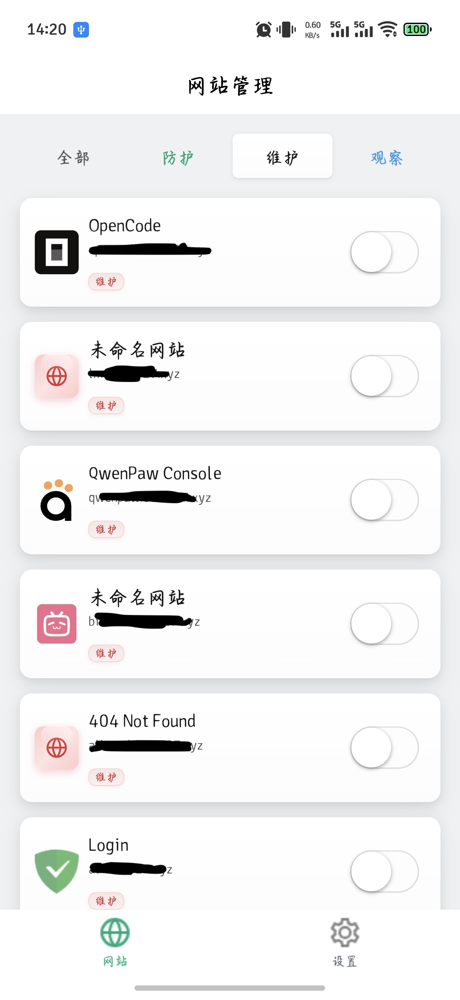
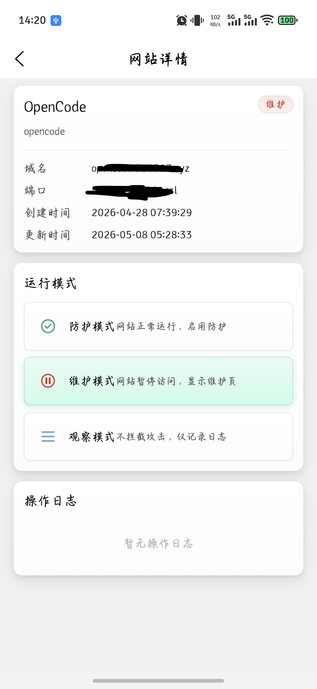
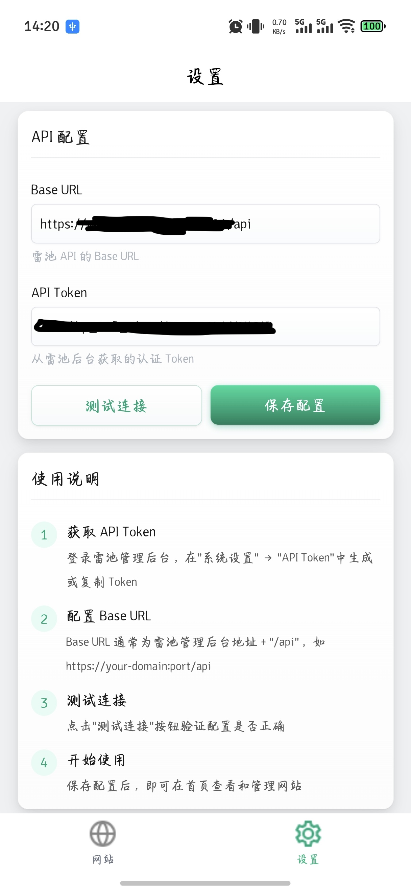

# Safeline App

基于 UniApp 开发的雷池（SafeLine）WAF 网站管理移动端应用，支持一键切换网站防护/维护模式。

## 功能

- **网站列表** - 展示所有防护网站，按状态筛选（防护/维护/观察）
- **状态切换** - 开关式一键切换网站运行模式，带遮罩防重复提交
- **网站详情** - 查看网站基础信息、当前状态、操作日志
- **API 配置** - 本地存储雷池 API 地址和 Token，支持连接测试
- **下拉刷新** - 首页和详情页支持下拉刷新数据

## 页面截图

| 首页                                                       | 详情页 | 设置页                                                      |
|----------------------------------------------------------|--------|----------------------------------------------------------|
|   |  |  |

## 技术栈

| 技术 | 说明 |
|------|------|
| [UniApp](https://uniapp.dcloud.net.cn/) | 跨端开发框架 |
| [TDesign UniApp](https://tdesign.tencent.com/miniprogram/overview) | 腾讯组件库 |
| SCSS | 样式预处理 |
| Hyperrealism | UI 设计风格 |

## 设计风格

采用 **3D-Hyperrealism（超写实）** 设计风格：
- 三层深度投影系统，模拟真实物理光照
- 玻璃质感卡片 + 顶部反射高光线
- 按钮光泽渐变 + 按压下沉反馈
- 浓郁翡翠绿主色调 `#0CA678`

## 页面结构

```
├── pages/index      # 首页 - 网站列表 + 状态筛选
├── pages/detail     # 详情页 - 网站信息 + 模式切换 + 操作日志
└── pages/settings   # 设置页 - API 配置 + 使用说明
```

## API 接口

基于 [SafeLine-CE mgt API](https://github.com/baozhuo92/safeline-app/blob/main/docs/SafeLine-CE%20mgt%20API.md)，使用 `X-SLCE-API-TOKEN` 请求头认证。

| 接口 | 方法 | 说明 |
|------|------|------|
| `/api/open/site` | GET | 获取网站列表 |
| `/api/open/site/{id}` | GET | 获取网站详情 |
| `/api/open/site/mode` | PUT | 批量切换运行模式 |
| `/api/open/site/{id}/log` | GET | 获取操作日志 |

### 运行模式

| 值 | 名称 | 说明 |
|----|------|------|
| `0` | 防护 | 网站正常运行，启用 WAF 防护 |
| `1` | 维护 | 网站暂停访问，显示维护页面 |
| `2` | 观察 | 不拦截攻击，仅记录日志 |

## 快速开始

### 环境要求

- HBuilderX 最新版 或 Node.js 16+
- 雷池 WAF **7.5 版本**（社区版）

> **推荐使用雷池 7.5 版本**：该版本可免费使用 API 功能，且不限制防护网站数量。更新版本可能限制API调用和网站数量。

### 安装运行

```bash
# 克隆项目
git clone https://github.com/baozhuo92/safeline-app.git
cd safeline-app

# 安装依赖
npm install

```
用 HBuilderX 打开项目目录运行。

### 配置 API

1. 登录雷池管理后台
2. 进入 系统设置 → API Token，生成或复制 Token
3. 打开 Safeline App，进入「设置」页面
4. 输入 Base URL（如 `https://your-domain:port/api`）和 Token
5. 点击「测试连接」验证，成功后「保存配置」

## 项目结构

```
Safeline-app/
├── pages/
│   ├── index/index.vue         # 首页
│   ├── detail/detail.vue       # 详情页
│   └── settings/settings.vue   # 设置页
├── utils/
│   └── api.js                  # API 服务封装
├── styles/
│   └── common.scss             # 公共样式（Hyperrealism）
├── static/
│   └── icons/                  # 图标资源
├── docs/
│   ├── SafeLine-CE mgt API.md  # API 文档
│   └── ideas/
│       └── safeline-app-design.md  # 设计文档
├── pages.json                  # 路由配置
├── App.vue                     # 应用入口
├── uni.scss                    # 全局变量
└── package.json
```

## License

MIT
